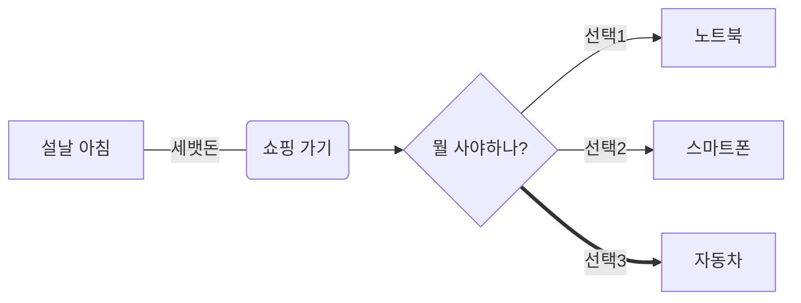
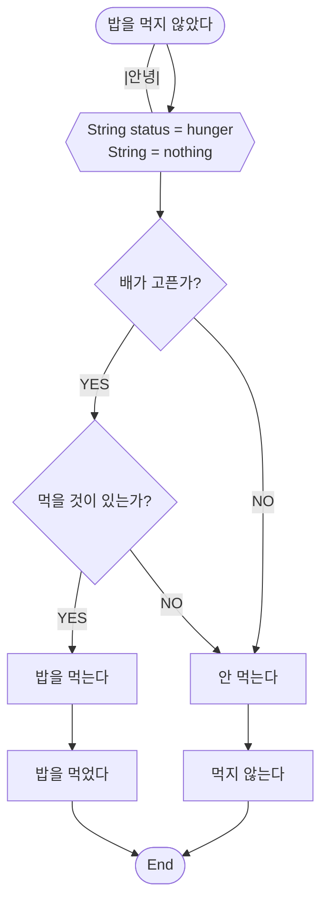
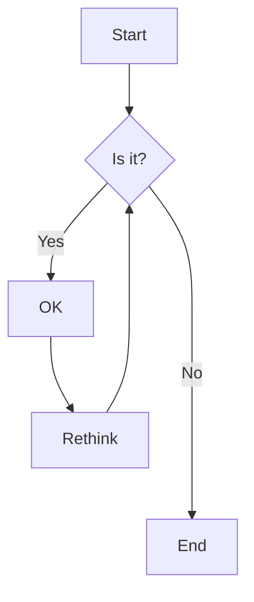

- 수업 시작

```mermaid
flowchart LR
    A[설날 아침] ---|세뱃돈| B(쇼핑 가기)
    B --> C{뭘 사야하나?}
    C -->|선택1| D[노트북]
    C -->|선택2| E[스마트폰]
    C ==>|선택3| F[자동차] 
```

```mermaid
flowchart TB
    a([밥을 먹지 않았다])
    --|안녕|---
    b{{String status = hunger <br> String = nothing}}
    c{배가 고픈가?}
    d{먹을 것이 있는가?}
    e[밥을 먹는다]
    f[밥을 먹었다]
    g([End])
    a --> b --> c -->|YES| d -->|YES| e --> f --> g
    
    h[안 먹는다]
    c -->|NO| h
    d --> |NO| h
    i[먹지 않는다]
    h --> i
    i --> g
```

```mermaid
flowchart TD
    A[Start] --> B{Is it?}
    B -->|Yes| C[OK]
    C --> D[Rethink]
    D --> B
    B ---->|No| E[End]
```